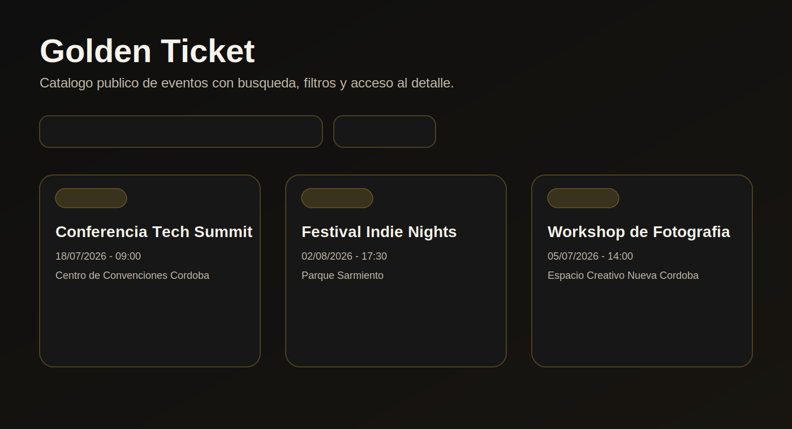
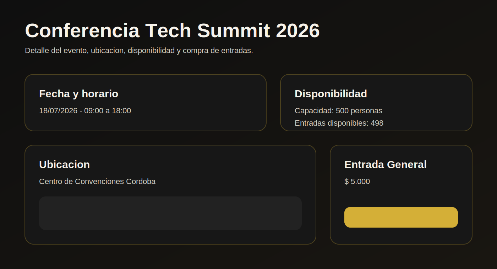
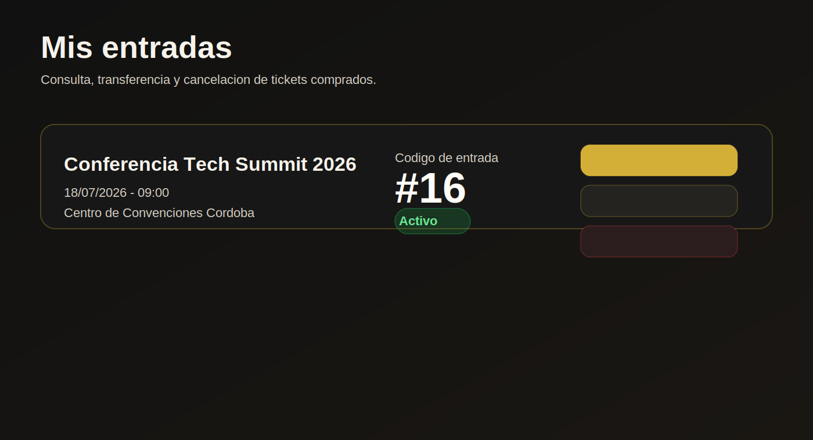
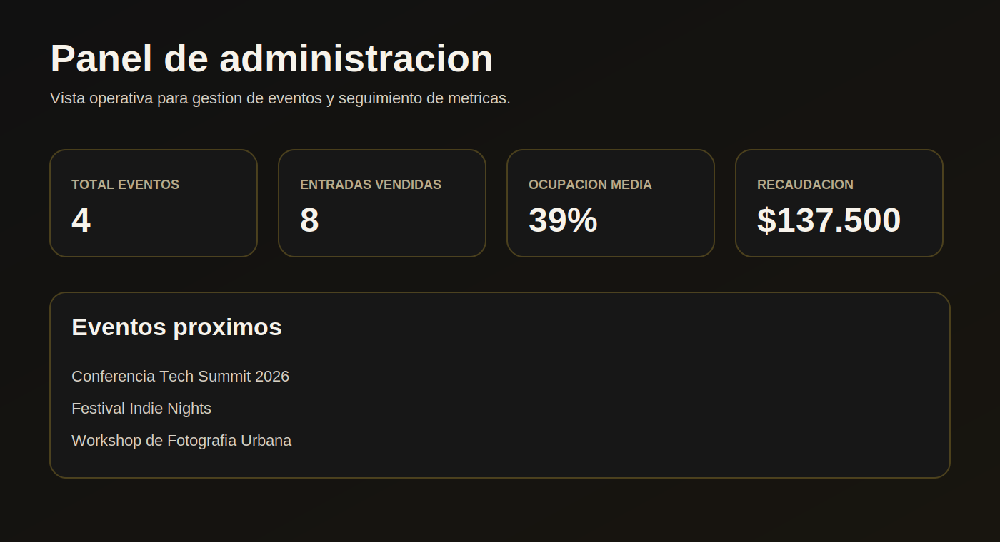
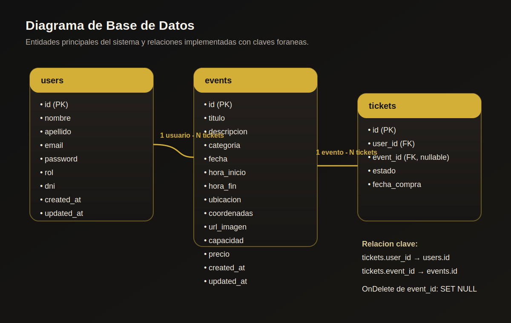

# Golden Ticket

Golden Ticket es una plataforma web para gestion de eventos y entradas, pensada para cubrir tanto la experiencia del cliente como la operacion administrativa. El sistema permite explorar eventos, comprar y gestionar entradas, y al mismo tiempo brinda un panel de administracion para crear eventos, editar su informacion y consultar metricas de ventas y ocupacion.

## Tabla de contenidos

- [Descripcion general](#descripcion-general)
- [Capturas de pantalla](#capturas-de-pantalla)
- [Tecnologias utilizadas](#tecnologias-utilizadas)
- [Requisitos previos](#requisitos-previos)
- [Instalacion y uso](#instalacion-y-uso)
- [Testing](#testing)
- [Diagrama de base de datos](#diagrama-de-base-de-datos)
- [Decisiones de diseño](#decisiones-de-diseño)

## Descripcion general

El proyecto esta dividido en dos capas:

- `backend/`: API REST en Go que gestiona autenticacion, eventos, tickets y estadisticas.
- `frontend/`: aplicacion React que consume la API y expone flujos diferenciados para clientes y administradores.

Flujos principales implementados:

- Registro e inicio de sesion con JWT.
- Navegacion publica del catalogo de eventos.
- Visualizacion del detalle de cada evento.
- Compra, transferencia y cancelacion de entradas.
- Vista de `Mis entradas`.
- Panel de administracion con CRUD de eventos y metricas.

## Capturas de pantalla

Las siguientes vistas de referencia se encuentran versionadas dentro de `docs/screenshots/`:

### Home



### Detalle de evento



### Mis entradas



### Panel de administracion



## Tecnologias utilizadas

### Backend

- Go `1.25`
- Gin
- GORM
- MySQL
- JWT (`github.com/golang-jwt/jwt/v5`)
- dotenv (`github.com/joho/godotenv`)

### Frontend

- React `19`
- Vite
- React Router DOM
- Axios
- CSS custom

### Herramientas de desarrollo

- Git y GitHub
- npm
- Go test / httptest

## Requisitos previos

Antes de ejecutar el proyecto localmente necesitas:

- `Go 1.25` o superior
- `Node.js 20` o superior
- `npm 10` o superior
- `MySQL 8` o compatible
- Una base de datos creada manualmente, por ejemplo `golden_ticket`

## Instalacion y uso

### 1. Clonar el repositorio

```bash
git clone git@github.com:matias-yelicich-ucc/Golden-Ticket.git
cd Golden-Ticket
```

### 2. Configurar variables de entorno

#### Backend

Crear `backend/.env`:

```env
DB_HOST=localhost
DB_PORT=3306
DB_USER=root
DB_PASSWORD=tu_password
DB_NAME=golden_ticket
JWT_SECRET=tu_secreto
JWT_EXPIRATION_HOURS=24
SERVER_PORT=8080
```

#### Frontend

Crear `frontend/.env`:

```env
VITE_API_URL=http://localhost:8080
```

### 3. Crear la base de datos

```sql
CREATE DATABASE golden_ticket;
```

### 4. Levantar el backend

```bash
cd backend
go mod tidy
go run main.go
```

Notas:

- El backend corre por defecto en `http://localhost:8080`.
- Las tablas se generan por automigracion al iniciar.

### 5. Levantar el frontend

```bash
cd frontend
npm install
npm run dev
```

El frontend queda disponible normalmente en:

```txt
http://localhost:5173
```

## Testing

### Backend

Ejecutar todos los tests:

```bash
cd backend
go test ./...
```

### Frontend

Actualmente el frontend no tiene una suite automatizada de tests unitarios integrada en `package.json`. Como validaciones disponibles hoy se pueden ejecutar:

```bash
cd frontend
npm run build
npm run lint
```

## Diagrama de base de datos

El diagrama se encuentra dentro de `docs/database-diagram.svg` y resume las entidades principales y sus relaciones.



## Decisiones de diseño

### 1. Separacion por capas en el backend

Se adopto una estructura `controllers -> services -> dao -> domain` para desacoplar responsabilidades. Esto facilita el testeo aislado, reduce el acoplamiento entre reglas de negocio y acceso a datos, y simplifica la evolucion de la API.

### 2. Conservacion del historial de tickets ante eliminacion de eventos

La relacion entre `tickets` y `events` se resolvio con `ON DELETE SET NULL`. Esto permite eliminar o depurar eventos sin perder el historial de compras ni invalidar el ticket como registro historico del sistema.

### 3. Diferenciacion explicita entre experiencia cliente y experiencia administrador

El frontend distingue los flujos de usuarios finales y administradores mediante rutas, paneles y acciones diferentes. Esta separacion reduce errores operativos, evita mezclar permisos en la interfaz y hace mas clara la navegacion para cada rol.

