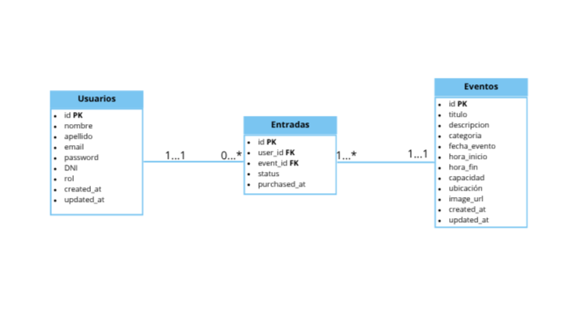

# Golden Ticket

Sistema de Gestión de Eventos y Entradas tipo Ticketek desarrollado para el Práctico Integrador 2026 de Desarrollo de Software.

---

## Descripción

Golden Ticket es una aplicación web para la gestión de eventos y entradas.

El sistema permite que los clientes puedan:

- Explorar eventos disponibles.
- Buscar y filtrar eventos.
- Ver el detalle completo de cada evento.
- Comprar entradas.
- Consultar sus entradas adquiridas.
- Cancelar compras.
- Transferir entradas a otros usuarios.

Además, incluye un panel de administración que permite:

- Crear eventos.
- Editar eventos.
- Eliminar o cancelar eventos.
- Consultar reportes de ocupación y ventas.

---

## Integrantes
- Baudino, José
- Romanutti, Andrés
- Yelicich. Matías

---

## Tecnologías utilizadas

### Backend
- Golang
- Gin
- GORM
- MySQL
- JWT
- Hashing de contraseñas
- Testing con `testing`, `httptest` y/o `testify`

### Frontend
- React
- Vite
- React Router DOM
- Axios
- CSS

### DevOps
- Docker
- Docker Compose

---

## Estructura del proyecto

```txt
golden-ticket/
│
├── backend/
│   ├── clients/
│   ├── controllers/
│   ├── dao/
│   ├── domain/
│   ├── services/
│   ├── utils/
│   ├── main.go
│   ├── go.mod
│   └── go.sum
│
├── frontend/
│   ├── public/
│   ├── src/
│   │   ├── components/
│   │   ├── pages/
│   │   ├── services/
│   │   ├── routes/
│   │   ├── styles/
│   │   └── main.jsx
│   ├── package.json
│   └── vite.config.js
│
├── docs/
│   ├── database-diagram.png
│   └── screenshots/
│
├── docker-compose.yml
├── README.md
└── .gitignore
```

---

## Funcionalidades del cliente
- [ ] Registro de usuario.
- [ ] Inicio de sesión.
- [ ] Cierre de sesión.
- [ ] Visualización del catálogo de eventos.
- [ ] Búsqueda de eventos.
- [ ] Filtrado de eventos por categoría, fecha o disponibilidad.
- [ ] Visualización del detalle de un evento.
- [ ] Compra de entrada.
- [ ] Mensaje de compra exitosa.
- [ ] Manejo visible de errores al comprar.
- [ ] Visualización de entradas adquiridas.
- [ ] Cancelación de entrada.
- [ ] Transferencia de entrada a otro usuario.

---

## Funcionalidades del administrador
- [ ] Inicio de sesión como administrador.
- [ ] Acceso a panel de administración protegido.
- [ ] Listado general de eventos.
- [ ] Creación de nuevos eventos.
- [ ] Edición de eventos existentes.
- [ ] Eliminación o cancelación de eventos.
- [ ] Visualización de métricas por evento.
- [ ] Reporte de entradas vendidas.
- [ ] Reporte de cupo disponible.
- [ ] Reporte de porcentaje de ocupación.
- [ ] Listado de compradores por evento.

---

## Backend
- [ ] API REST desarrollada en Golang.
- [ ] Servidor HTTP configurado.
- [ ] Uso de Gin como framework web.
- [ ] Estructura organizada por capas.
- [ ] Separación entre controladores, servicios, DAOs, modelos y utilidades.
- [ ] Manejo correcto de errores.
- [ ] Respuestas HTTP con códigos de estado adecuados.
- [ ] Validación de datos recibidos desde el frontend.
- [ ] Separación entre modelos de base de datos y DTOs.

---

## Autenticación y seguridad
- [ ] Endpoint de registro.
- [ ] Endpoint de login.
- [ ] Generación de token JWT.
- [ ] Token JWT firmado.
- [ ] Token JWT con expiración.
- [ ] Token con ID del usuario.
- [ ] Token con rol del usuario.
- [ ] Roles de usuario: `cliente` y `administrador`.
- [ ] Contraseñas hasheadas.
- [ ] Las contraseñas no se guardan en texto plano.
- [ ] Middleware de autenticación.
- [ ] Middleware de autorización por rol.
- [ ] Validación de permisos en endpoints protegidos.
- [ ] Validación de permisos de administrador en endpoints administrativos.

---

## Base de datos
- [ ] Base de datos MySQL.
- [ ] Conexión desde Golang usando GORM.
- [ ] Migración o creación automática de tablas.
- [ ] Relaciones configuradas con claves foráneas.
- [ ] Modelo sin duplicación innecesaria de información.

### Entidades principales
- [ ] Usuarios.
- [ ] Eventos.
- [ ] Entradas.

### Entidades opcionales
- [ ] Categorías.
- [ ] Transferencias.
- [ ] Compras.
- [ ] Reportes.
- [ ] Imágenes de eventos.

---

## Usuario
- [ ] ID.
- [ ] Nombre.
- [ ] Apellido.
- [ ] Email o username.
- [ ] Contraseña hasheada.
- [ ] Rol.
- [ ] Fecha de creación.
- [ ] Fecha de actualización.

---

## Evento
- [ ] ID.
- [ ] Título.
- [ ] Descripción.
- [ ] Imagen o foto.
- [ ] Fecha.
- [ ] Horario.
- [ ] Duración.
- [ ] Ubicación.
- [ ] Categoría.
- [ ] Cupo máximo.
- [ ] Cupo disponible o entradas vendidas.
- [ ] Precio.
- [ ] Estado.
- [ ] Fecha de creación.
- [ ] Fecha de actualización.

---

## Entrada
- [ ] ID.
- [ ] Código o identificador único.
- [ ] Usuario titular.
- [ ] Evento asociado.
- [ ] Estado.
- [ ] Fecha de compra.
- [ ] Fecha de cancelación.
- [ ] Fecha de transferencia.

---

## Endpoints principales

### Autenticación
```txt
POST /register
POST /login
```

### Eventos públicos
```txt
GET /events
GET /events/:id
```

### Cliente
```txt
POST /events/:id/tickets
GET /my-tickets
DELETE /tickets/:id
POST /tickets/:id/transfer
```

### Administrador
```txt
POST /admin/events
PUT /admin/events/:id
DELETE /admin/events/:id
GET /admin/events/:id/reports
```

---

## Frontend
- [ ] Aplicación desarrollada en React.
- [ ] Uso de Vite.
- [ ] Uso de React Router DOM.
- [ ] Uso de Axios para consumir la API.
- [ ] Manejo de rutas públicas.
- [ ] Manejo de rutas protegidas.
- [ ] Manejo de rutas exclusivas para administrador.
- [ ] Manejo de estados de carga.
- [ ] Manejo visual de errores.
- [ ] Diseño responsive.

---

## Pantallas del frontend

### Públicas
- [ ] Login.
- [ ] Registro.
- [ ] Home / Catálogo de eventos.
- [ ] Detalle de evento.

### Cliente
- [ ] Gestión de compra.
- [ ] Compra exitosa.
- [ ] Mis entradas.
- [ ] Cancelar entrada.
- [ ] Transferir entrada.

### Administrador
- [ ] Panel de administración.
- [ ] Formulario de creación de evento.
- [ ] Formulario de edición de evento.
- [ ] Confirmación de eliminación de evento.
- [ ] Reportes y métricas.

---

## Testing
- [ ] Tests unitarios en backend.
- [ ] Tests de servicios.
- [ ] Tests de controladores.
- [ ] Tests de integración HTTP.
- [ ] Tests de endpoints públicos.
- [ ] Tests de endpoints protegidos.
- [ ] Tests de endpoints administrativos.
- [ ] Tests de login correcto.
- [ ] Tests de login inválido.
- [ ] Tests de compra de entrada.
- [ ] Tests de cancelación de entrada.
- [ ] Tests de transferencia de entrada.
- [ ] Cobertura mínima del 40% para regularidad.
- [ ] Cobertura objetivo del 80% para examen final.

---

## Códigos de estado esperados
- [ ] `200 OK` para operaciones exitosas.
- [ ] `201 Created` para creación exitosa.
- [ ] `400 Bad Request` para datos inválidos.
- [ ] `401 Unauthorized` para login inválido o token ausente.
- [ ] `403 Forbidden` para usuario sin permisos.
- [ ] `404 Not Found` para recurso inexistente.
- [ ] `409 Conflict` para conflictos de negocio.
- [ ] `500 Internal Server Error` para errores inesperados.

---

## Docke
- [ ] Dockerfile para backend.
- [ ] Dockerfile para frontend.
- [ ] Docker Compose configurado.
- [ ] Servicio de backend.
- [ ] Servicio de frontend.
- [ ] Servicio de MySQL.
- [ ] Variables de entorno configuradas.
- [ ] El proyecto puede levantarse con un solo comando.

---

## Instalación y ejecución

### Clonar repositorio
```bash
git clone URL_DEL_REPOSITORIO
cd golden-ticket
```

### Ejecutar backend
```bash
cd backend
go mod tidy
go run main.go
```

### Ejecutar frontend
```bash
cd frontend
npm install
npm run dev
```

### Ejecutar con Docker
```bash
docker compose up --build
```

---

## Variables de entorno

### Backend
```env
DB_HOST=localhost
DB_PORT=3306
DB_USER=root
DB_PASSWORD=password
DB_NAME=golden_ticket
JWT_SECRET=secret
JWT_EXPIRATION_HOURS=24
SERVER_PORT=8080
```

### Frontend
```env
VITE_API_URL=http://localhost:8080
```

---

## Documentación
- [ ] README completo.
- [ ] Instrucciones de instalación.
- [ ] Instrucciones de ejecución.
- [ ] Instrucciones para correr tests.
- [ ] Capturas de pantalla.
- [ ] Diagrama de base de datos.
- [ ] Decisiones de diseño.
- [ ] Documentación de endpoints principales.

---

## Capturas de pantalla
- [ ] Login.
- [ ] Registro.
- [ ] Home / Catálogo.
- [ ] Detalle de evento.
- [ ] Compra exitosa.
- [ ] Mis entradas.
- [ ] Panel administrador.
- [ ] Formulario de evento.
- [ ] Reportes y métricas.

---

## Diagrama de base de datos


---

## Decisiones de diseño
### Baja lógica de eventos
Los eventos pueden manejarse mediante baja lógica para evitar perder información histórica de compras y reportes.

### Liberación de cupo
Cuando una entrada se cancela, el cupo del evento vuelve a estar disponible si el evento sigue activo.

### Separación de capas
El backend separa controladores, servicios y acceso a datos para mejorar mantenibilidad y testeo.

### Autorización por roles
Las acciones administrativas se protegen validando el rol del usuario desde el token JWT.

---

## Bonus Track
- [ ] Definir funcionalidad extra.
- [ ] Informar la funcionalidad extra al docente.
- [ ] Implementar funcionalidad extra.
- [ ] Documentar funcionalidad extra.
- [ ] Agregar tests si corresponde.
