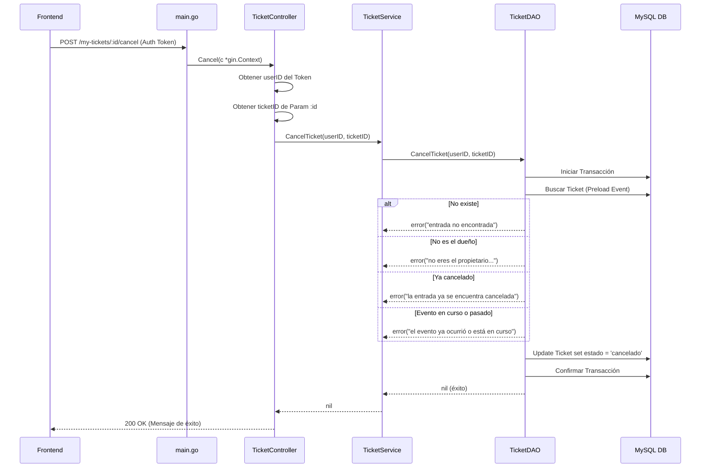

# Diseño Técnico: Cancelación de Compra de Entrada (Cliente E)

## 1. Modificaciones en el Backend



### 1.1. Capa de Datos (DAO)
Modificaremos `backend/dao/ticket_dao.go`.
* **Interface**:
  ```go
  type TicketDAO interface {
      // ...
      CancelTicket(userID uint, ticketID uint) error
  }
  ```
* **Implementación**:
  ```go
  func (d *ticketDAOImpl) CancelTicket(userID uint, ticketID uint) error {
      return DB.Transaction(func(tx *gorm.DB) error {
          var ticket domain.Ticket
          // Preload Event para validar la fecha del evento
          if err := tx.Preload("Event").First(&ticket, ticketID).Error; err != nil {
              if errors.Is(err, gorm.ErrRecordNotFound) {
                  return errors.New("entrada no encontrada")
              }
              return err
          }

          if ticket.UserID != userID {
              return errors.New("no eres el propietario de esta entrada")
          }

          if ticket.Estado != "activo" {
              return errors.New("la entrada ya se encuentra cancelada")
          }

          // Validar que el evento no haya ocurrido ni esté en curso
          if ticket.Event != nil {
              eventDateTimeStr := fmt.Sprintf("%sT%s:00", ticket.Event.Fecha, ticket.Event.HoraInicio)
              eventTime, err := time.ParseInLocation("2006-01-02T15:04:05", eventDateTimeStr, time.Local)
              if err == nil && eventTime.Before(time.Now()) {
                  return errors.New("no se pueden cancelar entradas para un evento que ya ocurrió o está en curso")
              }
          }

          // Actualizar estado
          ticket.Estado = "cancelado"
          if err := tx.Save(&ticket).Error; err != nil {
              return err
          }

          return nil
      })
  }
  ```

### 1.2. Capa de Servicio
Modificaremos `backend/services/ticket_service.go`.
* **Interface**:
  ```go
  type TicketService interface {
      // ...
      CancelTicket(userID uint, ticketID uint) error
  }
  ```
* **Implementación**:
  ```go
  func (s *ticketServiceImpl) CancelTicket(userID uint, ticketID uint) error {
      return s.ticketDAO.CancelTicket(userID, ticketID)
  }
  ```

### 1.3. Capa de Controladores
Modificaremos `backend/controllers/ticket_controller.go`.
* **Implementación**:
  ```go
  func (ctrl *TicketController) Cancel(c *gin.Context) {
      userIDVal, exists := c.Get("userID")
      if !exists {
          c.JSON(http.StatusUnauthorized, gin.H{"error": "Usuario no autenticado"})
          return
      }
      userID, ok := userIDVal.(uint)
      if !ok {
          c.JSON(http.StatusInternalServerError, gin.H{"error": "ID de usuario inválido en el contexto"})
          return
      }

      ticketIDStr := c.Param("id")
      ticketID, err := strconv.ParseUint(ticketIDStr, 10, 32)
      if err != nil {
          c.JSON(http.StatusBadRequest, gin.H{"error": "ID de entrada inválido"})
          return
      }

      err = ctrl.ticketService.CancelTicket(userID, uint(ticketID))
      if err != nil {
          status := http.StatusBadRequest
          errStr := err.Error()

          if errStr == "entrada no encontrada" {
              status = http.StatusNotFound
          } else if errStr == "no eres el propietario de esta entrada" {
              status = http.StatusForbidden
          }

          c.JSON(status, gin.H{"error": errStr})
          return
      }

      c.JSON(http.StatusOK, gin.H{"message": "Entrada cancelada con éxito y cupo liberado"})
  }
  ```

---

## 2. Modificaciones en el Frontend

### 2.1. API Client (`services/api/client.js`)
Agregaremos una función para llamar al nuevo endpoint.
```javascript
export const cancelTicket = async (ticketId) => {
  const response = await apiClient.post(`/my-tickets/${ticketId}/cancel`);
  return response.data;
};
```

### 2.2. Componente de UI (`pages/tickets/MyTickets.jsx`)
* Se agregará un botón con clase `.btn-cancel` en cada fila/tarjeta de ticket activo.
* Se mantendrá un estado de `selectedTicketForCancel` para controlar la apertura del modal.
* El modal de devolución compartirá las mismas clases CSS de los modales del sitio (ej. `.modal-overlay`, `.modal-content`) para mantener consistencia visual.
